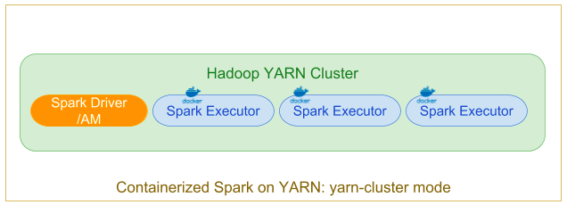

# How simplify Spark dependency management with Docker in EMR 6.x?

Today, pyspark users install pyspark dependencies on each host in an EMR cluster (usually with custom script or bootstrap actionds). This increase the complexity and cause many issue when the enviroment is multi-tenant or you have to run different libraries verions for different jobs (e.g. in case of machine learning or deep learning applications).
Now, we can use Docker/YARN (from Hadoop 3.x) to manage Spark Dependencies. Application dependencis can now be scope for each individual application. The dependencies will be espressed in a Dockerfile and in the corresponding Docker image.

EMR 6.x is by default ready to run pyspark inside a docker.

EMR 6 supports registry like dockehub or private registry like AWS EMR repositories. Each node of the cluster will download the docker build image from your registry.

For Amazon EMR 6.x, the following Docker registries can be configured:
- Docker Hub
- Amazon ECR


The base Spark and Hadoop libraries and related configurations installed on the cluster are distributed automatically to all of the Spark hosts in the cluster using AWS EMR features, and are mounted into the Docker containers automatically by YARN.

In addition, any binaries (–files, –jars, etc.) explicitly included by the user when the application is submitted are also made available via the distributed cache of Hadoop 3.

In the "classic" distributed application YARN cluster mode, a user (or a Step Function) submits a Spark job to be executed, which is scheduled and executed by YARN. The ApplicationMaster hosts the Spark driver, which is launched on the cluster in a Docker container (the executors are in Docker containers).



# Build the docker image


From pyspark-latest/Dockerfile we will build our docker image.
You can build the image from your local laptop or (I prefer) use an EC2 instance.

```
sudo docker build -t 'local/pyspark-latest' pyspark-latest/
```

# Create your ECR Repository and push the Docker image

You can use a private docker repository or a public registry.

For example, It is easy to create an ECR repository in your AWS account:

```
aws ecr create-repository --repository-name emr-docker-test --region us-east-1  --profile yourprofile
```

Take note of the result of this command:
```
{
    "repository": {
        "repositoryArn": "arn:aws:ecr:us-east-1:123456789123:repository/emr-docker-test",
        "registryId": "123456789123",
        "repositoryName": "emr-docker-test",
        "repositoryUri": "123456789123.dkr.ecr.us-east-1.amazonaws.com/emr-docker-test",
        "createdAt": 1606302897.0,
        "imageTagMutability": "MUTABLE",
        "imageScanningConfiguration": {
            "scanOnPush": false
        }
    }
}
```

Now, we will tag our locally Docker build image with our AWS EMR end point:

```
sudo docker tag local/pyspark-latest 123456789123.dkr.ecr.us-east-1.amazonaws.com/emr-docker-test:pyspark-latest
```

Get the login line for our AWS ECR account:

```
aws ecr get-login --region us-east-1 --no-include-email --profile yourprofile
```

And run the output of the command (for example):

```
sudo docker login -u AWS -p <password> https://123456789123.dkr.ecr.us-east-1.amazonaws.com
```

Now, we can push our locally build image to AWS ECR:

```
sudo docker push 123456789123.dkr.ecr.us-east-1.amazonaws.com/emr-docker-test:pyspark-latest
```

After this push is complete, the Docker image is available to use with your EMR cluster.

# Integration AWS EMR and Docker

First of all we need to create a configuration file for our AWS EMR. We have two options:
- copy the content of the file emr-configuration.json and paste it inside the CLI
- create a local file

Remember to check the content of the file and replace the registry ID with your registry ID.


The config file contains `docker.trusted.registries` and `docker.privileged-containers.registries` that is the list of trusted docker registries

```
[
  {
    "Classification": "container-executor",
    "Configurations": [
        {
            "Classification": "docker",
            "Properties": {
                "docker.trusted.registries": "local,centos,your-public-repo,123456789123.dkr.ecr.us-east-1.amazonaws.com",
                "docker.privileged-containers.registries": "local,centos,your-public-repo,123456789123.dkr.ecr.us-east-1.amazonaws.com"
            }
        }
    ]
  }
]
```

To execute a Spark application in a Docker container, the following configuration options are necessary:
```
YARN_CONTAINER_RUNTIME_TYPE=docker
YARN_CONTAINER_RUNTIME_DOCKER_IMAGE={DOCKER_IMAGE_NAME}
```

When using Amazon ECR to retrieve Docker images, you must configure the cluster to authenticate itself. To do so, you must use the following configuration option:

```
YARN_CONTAINER_RUNTIME_DOCKER_CLIENT_CONFIG={DOCKER_CLIENT_CONFIG_PATH_ON_HDFS}
```

For EMR 6.1.0, you are not required to use the listed command YARN_CONTAINER_RUNTIME_DOCKER_CLIENT_CONFIG={DOCKER_CLIENT_CONFIG_PATH_ON_HDFS} when the ECR auto authentication feature is enabled.

After the configuration of the file we can create the cluster with the AWS CLI (for this example we will use a small cluster with 3 nodes: 1 master and 2 cores: the docker integration also works with task instances):

```
aws emr create-cluster \
 --applications Name=Hadoop Name=Spark Name=ZooKeeper Name=Ganglia \
--name 'EMR 6.1.0 with Docker' \
--release-label emr-6.1.0 \
--applications Name=Livy Name=Spark \
--ec2-attributes "KeyName=your_key,SubnetId=subnet-123456789123" \
--instance-type m5.xlarge --instance-count 3 \
--use-default-roles \
--configurations file://./emr-configuration/emr-configuration.json \
--region us-east-1 \
--profile bgtdev
```


## Configure ECR credentials on AWS EMR 6.0.0 (or when IAM Role doesn't have ecr:GetAuthorizationToken)

AWS EMR 6.0.0 doesn't support directly the auto-configuration for EMR and ECR integration. So, we have to configure it manually by creation of a config file om HDFS.

To add the config file, wait until the cluster is in `Waiting state` then use your EC2 key pair to SSH 
into one of the `core nodes` of the cluster.

```
ssh -i yourkey.pem ec2-user@your-core-nodes-public-address
```
(note: if connection is not allowed, check the security group of the instance and enable SSH Port for your ip address)

Now we can get the credentials for AWS ECR.
This credentials will used by AWS EMR to dowload the build image.

aws ecr get-login --region us-east-1 --no-include-email --profile yourprofile

Run the output command (like this):

```
sudo docker login -u AWS -p <password> https://123456789123.dkr.ecr.us-east-1.amazonaws.com 
```

This command generates a `config.json` file in the `/root/.docker` folder.
Put this file on HDFS:
```
sudo hdfs dfs -put /root/.docker/config.json /user/hadoop/
```

Now YARN can access ECR as a Docker image registry and pull containers during job execution.

# Configure automatic authentication on EMR 6.1

EMR 6.1.0 supports automatic authentication on EMR 6.1.
If an Amazon ECR registry is detected in the container-executor classification key, the Amazon ECR auto authentication feature activates and YARN handles the authentication process when you submit a Spark job with an ECR image.
Automatic authentication is enabled and the YARN authentication setting is set to true if the docker.trusted.registries contains an ECR registry URL.

Prerequisites for using automatic authentication to Amazon ECR:
- EMR version 6.1.0 or later
- ECR registry included in configuration is in the same Region with the cluster
- IAM role with permissions to get authorization token and pull any image (if you are using EMR_Default_Role, this role has to be enabled to ecr:GetAuthorizationToken)

# EMR Notebook (or emr job)

Now, we can create and EMR Notebook to test the solution.

To create a notebook, run this steps:
1. Connect to AWS Console, and choose the EMR section
2. Click on Notebooks in the EMR Console (in the left side bar of the screen)
3. Choose a name for your notebook
4. Click Choose an existing cluster and select the cluster you created few minutes ago
5. Click on Create notebook button

When the Notebook is in the `Ready` state, we can use the `Open Jupyter` button to access to the notebooks.
From the new button we can create a PySpark Kernel.

In the first cell, just configure the session:
```
%%configure -f
{"conf": { "spark.pyspark.virtualenv.enabled": "false" }}
```

In the second cell use the script from emrdocker.py


```
from pyspark.sql import SparkSession
spark = SparkSession.builder.appName("docker-numpy").getOrCreate()
sc = spark.sparkContext

import numpy as np
a = np.arange(15).reshape(3, 5)
print(a)
print(np.__version__)
```

The output should look like the following screenshot; the numpy version in use is the latest.

Note: remember to stop the EMR Notebook and the cluster at the end of your work ;) 


To run a job (for example add a step to the cluster) you need to specify the yarn container runtime:

```
DOCKER_IMAGE_NAME=123456789123.dkr.ecr.us-east-1.amazonaws.com/emr-docker-examples:pyspark-example
DOCKER_CLIENT_CONFIG=hdfs:///user/hadoop/config.json
spark-submit --master yarn \
--deploy-mode cluster \
--conf spark.executorEnv.YARN_CONTAINER_RUNTIME_TYPE=docker \
--conf spark.executorEnv.YARN_CONTAINER_RUNTIME_DOCKER_IMAGE=$DOCKER_IMAGE_NAME \
--conf spark.executorEnv.YARN_CONTAINER_RUNTIME_DOCKER_CLIENT_CONFIG=$DOCKER_CLIENT_CONFIG \
--conf spark.executorEnv.YARN_CONTAINER_RUNTIME_DOCKER_MOUNTS=/etc/passwd:/etc/passwd:ro \
--conf spark.yarn.appMasterEnv.YARN_CONTAINER_RUNTIME_TYPE=docker \
--conf spark.yarn.appMasterEnv.YARN_CONTAINER_RUNTIME_DOCKER_IMAGE=$DOCKER_IMAGE_NAME \
--conf spark.yarn.appMasterEnv.YARN_CONTAINER_RUNTIME_DOCKER_CLIENT_CONFIG=$DOCKER_CLIENT_CONFIG \
--conf spark.yarn.appMasterEnv.YARN_CONTAINER_RUNTIME_DOCKER_MOUNTS=/etc/passwd:/etc/passwd:ro \
--num-executors 2 \
main.py -v
```

# Using a Docker image from Docker Hub

To use Docker Hub or your custom private registry, note:
- you must deploy your cluster to a public subnet
- configure it to use Docker Hub as a trusted registry

```
[
  {
    "Classification": "container-executor",
    "Configurations": [
        {
            "Classification": "docker",
            "Properties": {
                "docker.trusted.registries": "local,centos,your-public-repo ",
                "docker.privileged-containers.registries": "local,centos,your-public-repo"
            }
        }
    ]
  }
]
```